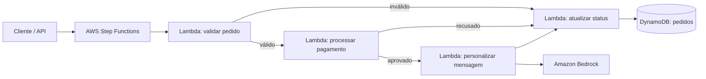

# Assistente de Delivery com AWS Step Functions e Amazon Bedrock

Projeto prático do Bootcamp da Nublify no DIO que automatiza a jornada de um pedido de delivery: validação, pagamento, personalização da comunicação com IA e atualização de status.

## Arquitetura



## O que o fluxo faz

1. Valida itens, endereço e valor total do pedido.
2. Simula uma integração de pagamento e bloqueia pedidos recusados.
3. Usa o Amazon Bedrock para criar uma mensagem curta e personalizada para o cliente.
4. Registra o status final no Amazon DynamoDB.
5. Centraliza tratamento de erros no Step Functions, sem expor detalhes técnicos ao cliente.

## Tecnologias

- AWS Step Functions
- AWS Lambda (Python 3.12)
- Amazon Bedrock Runtime
- Amazon DynamoDB
- AWS SAM

## Estrutura

```text
.
├── src/
│   ├── validate_order/app.py
│   ├── process_payment/app.py
│   ├── personalize_order/app.py
│   └── update_status/app.py
├── statemachine/delivery.asl.json
├── tests/test_handlers.py
├── template.yaml
└── events/pedido-exemplo.json
```

## Pré-requisitos

- AWS CLI autenticada em uma conta AWS;
- AWS SAM CLI;
- um modelo do Bedrock habilitado na região escolhida. O padrão do projeto é `amazon.nova-lite-v1:0` em `us-east-1`.

## Deploy

```bash
sam build
sam deploy --guided
```

No assistente de deploy, informe um nome de stack e mantenha a região `us-east-1` ou escolha outra que tenha o modelo Bedrock habilitado.

## Executando um pedido de teste

Após o deploy, obtenha a ARN da máquina de estados na saída da stack e execute:

```bash
aws stepfunctions start-execution \
  --state-machine-arn SUA_STATE_MACHINE_ARN \
  --input file://events/pedido-exemplo.json
```

Entrada de exemplo:

```json
{
  "orderId": "PED-2026-001",
  "customer": { "name": "Ana Souza" },
  "items": [{ "name": "Pizza Margherita", "quantity": 1 }],
  "total": 49.9,
  "payment": { "method": "PIX", "approved": true },
  "deliveryAddress": "Rua Exemplo, 123"
}
```

## Insights

- Step Functions separa a orquestração da regra de negócio e oferece histórico visual de cada execução.
- O Bedrock é chamado apenas depois do pagamento aprovado, reduzindo custo e evitando personalizar pedidos que não serão entregues.
- O DynamoDB é apropriado para consultas rápidas por `orderId` e pode evoluir para suportar rastreamento em tempo real.
- Em produção, o simulador de pagamento deve ser substituído por uma integração segura com gateway, usando Secrets Manager e idempotência.

## Permissões

O template aplica apenas as permissões necessárias: invocação das Lambdas pela state machine, escrita na tabela de pedidos e `bedrock:InvokeModel` para a Lambda de personalização.

## Limpeza

Para evitar cobranças após os testes:

```bash
sam delete
```

## Licença

MIT.
